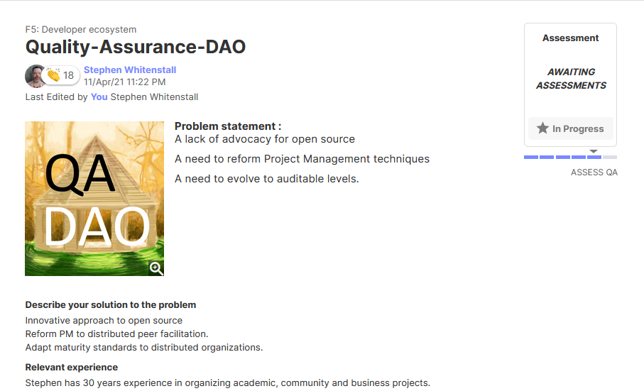

# Welcome to Quality Assurance DAO

## What is Quality Assurance DAO ?


QA-DAO has submitted proposals in Fund 6 of Project Catalyst. Follow this [link ](https://stephen-rowan.gitbook.io/quality-assurance-dao/fund-6-proposals/summary)to the Fund 6 Proposals Section for more details.


Quality Assurance DAO \(QA-DAO\) is an ongoing open source project that provides support for the Cardano Project Catalyst Community. 

In Fund 5 of Project Catalyst QA-DAO submitted a proposal "[Quality Assurance DAO](https://stephen-rowan.gitbook.io/quality-assurance-dao/catalyst-proposals/project-catalyst-developer-ecosystem-proposal)" in the Developer Ecosystem Challenge that sought to encourage open-source collaboration & innovation and to do a QA Assessment of Catalyst Proposal Process itself. This proposal was successful in receiving votes and was funded in August 2021. Governance of the Quality Assurance DAO Fund 5 proposal may be followed [here](https://stephen-rowan.gitbook.io/quality-assurance-dao/catalyst-proposals/fund-5-developer-ecosystem-proposal-governance).

QA-DAOs own GitHub Organization is at [https://github.com/Quality-Assurance-DAO](https://github.com/Quality-Assurance-DAO).

### Documentation


QA-DAO designs and maintains documentation in open-source GitHub repositories for the Catalyst Circle, Catalyst Swarm, The Catalyst Alliance and The Catalyst School.


### Transparent Governance


QA-DAO reports on and tracks Catalyst Governance experiments such as the Catalyst Circle.


### Training


QA-DAO provides support and training for the Project Catalyst community via the Catalyst School.


### Research


QA-DAO collates current research in the Cardano ecosystem and original research from the Catalyst community in the [Ekphrasis ](https://stephen-rowan.gitbook.io/ekphrasis/)journal.


## Background

The Quality Assurance DAO was founded by Stephen Whitenstall in April 2021 and grew out of a Project Catalyst Fund 5 Proposal 



