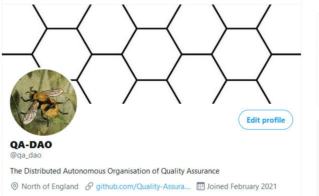

# Background

##

A brief history of QA-DAO

## Welcome to Quality Assurance DAO

### What is Quality Assurance DAO ?


QA-DAO has submitted proposals in Project Catalyst since Fund 5.


Quality Assurance DAO (QA-DAO) is an ongoing open source project that provides support for the Cardano Project Catalyst Community.

In Fund 5 of Project Catalyst QA-DAO submitted a proposal "[Quality Assurance DAO](https://stephen-rowan.gitbook.io/quality-assurance-dao/catalyst-proposals/project-catalyst-developer-ecosystem-proposal)" in the Developer Ecosystem Challenge that sought to encourage open-source collaboration & innovation and to do a QA Assessment of Catalyst Proposal Process itself. This proposal was successful in receiving votes and was funded in August 2021. Governance of the Quality Assurance DAO Fund 5 proposal may be followed [here](https://stephen-rowan.gitbook.io/quality-assurance-dao/catalyst-proposals/fund-5-developer-ecosystem-proposal-governance).

QA-DAOs own GitHub Organization is at [https://github.com/Quality-Assurance-DAO](https://github.com/Quality-Assurance-DAO).

#### Documentation


QA-DAO designs and maintains documentation in open-source GitHub repositories for the Catalyst Circle, Catalyst Swarm, The Catalyst Alliance and The Catalyst School.


#### Transparent Governance


QA-DAO reports on and tracks Catalyst Governance experiments such as the Catalyst Circle.


#### Training


QA-DAO provides support and training for the Project Catalyst community via the Catalyst School.


#### Research


QA-DAO collates current research in the Cardano ecosystem and original research from the Catalyst community in the [Ekphrasis ](https://stephen-rowan.gitbook.io/ekphrasis/)journal.


### Background

The Quality Assurance DAO was founded by Stephen Whitenstall in April 2021 and grew out of a Project Catalyst Fund 5 Proposal



## Media

### Twitter - [https://twitter.com/qa\_dao](https://twitter.com/qa\_dao)

### Cardano Project Catalyst Discord Channel - Fund 5 Proposal



### Youtube Channel - Stephen Whitenstall



### QA-DAO in the media

#### Project Catalyst Town Hall #16

**July 14th 2021**

[00:04:17](https://www.youtube.com/watch?v=\_H-dSnMmpA4\&t=257s) Presentation by Stephen Whitenstall from Catalyst GitBook Project



#### Tracking effort and merit in Cardano

**11th July 2021**



Tracking effort and merit, NFTs, social media, SourceCred and testing it out in The Catalyst Alliance. A detailed summary can be found [here ](https://www.youtube.com/redirect?event=video\_description\&redir\_token=QUFFLUhqbXNWVFM3LUYxbktXbWVoU0xOeGw2VkV5OEluZ3xBQ3Jtc0tsMVluTzQ3QXdGMzVEUHlQQXFnb0V6Z0R1VUI1bTR3NjNFUTJ2OEZLeG1Ld0NUWmpqQ3RWUzJxdXJjMTlUR3dhbUVKR1FvOUNvdXFJTEhnQ2ozSlNELUVpYklVTmQxVGhFXzNlT0dHTjdWOE5uWDZOUQ\&q=https%3A%2F%2Fcatalyst-swarm.gitbook.io%2Fthe-catalyst-alliance%2Ftracking-effort-and-merit-in-cardano%2Ftracking-effort-and-merit-in-cardano%23meeting-8th-july-2021).

#### SourceCred Use, Set-Up and Strategy

**5th July 2021**

Danielo Ospina (Aragon), Stephen Whitenstall, Tevo, Seomon (Catalyst Swarm) and Tyler Wales (Secret Decks)



## Partners

### Ekphrasis

This GitBook is a repository of academic content across the wider Cardano community. From IOHK, Project Catalyst and University of Edinburgh as well as many other sources.

It is maintained by under the benevolent dictatorship of Stephen Whitenstall, (Catalyst Swarm/Secret Decks/QA-DAO).


