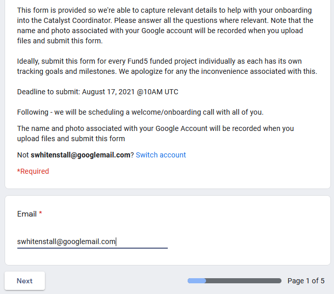

# Fund 5, Developer Ecosystem Proposal - Governance

## Overview

This section will report the progress of the **Fund 5 - Quality Assurance DAO** project as it documents and assess the Fund 5 Governance process. This will include documenation of the pathway of a funded cohort and an assessment of funded cohort reporting requirements.

## Cohort On-boarding - Email Survey 

## Email

## General Project Information

### What is your project title as it appears on Ideascale? 

Quality-Assurance-DAO

### Please, provide ONE sentence description of your project that best characterizes its purpose and intent.  

QA Assessment of Catalyst Proposal Process. 

### What specific industry does your proposal cater to?  

Quality Assurance / Information Technology 

### Who are the end users of your proposal project? \* Everyone, governments, enterprises, etc. 

Project Catalyst Voters, Community, Proposers, Implementers and Community Advisors.

### How many members does your team have today? 

1 \(yourself\)

### What is your current planned implementation/delivery date?

When do you expect the scope of the proposal to be fully implemented? 

29/09/2021

### Please provide a link to your Catalyst proposal on Ideascale. 

 [https://cardano.ideascale.com/a/dtd/Quality-Assurance-DAO/351678-48088](https://cardano.ideascale.com/a/dtd/Quality-Assurance-DAO/351678-48088) 

### What is your primary Ideascale username that published the proposal?  

@swhitenstall 

### Which challenge were you successful in ?

Developer Ecosystem

### Were you previously successful in any of the past funding rounds? Like Fund1, 2, 3,4? 

No

### Page 3

### Page 4

### Page 5

