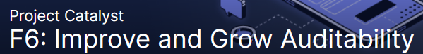
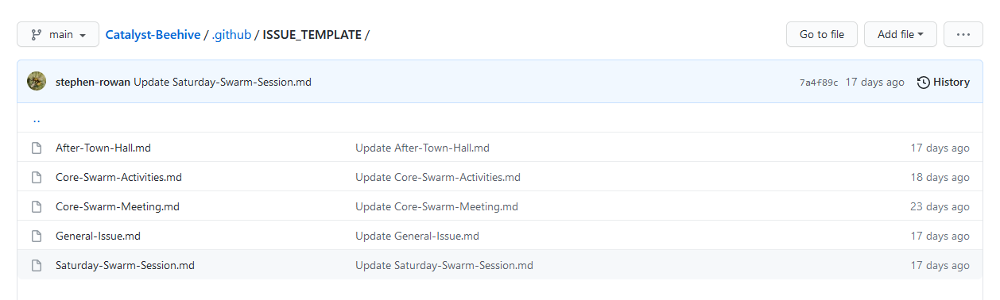
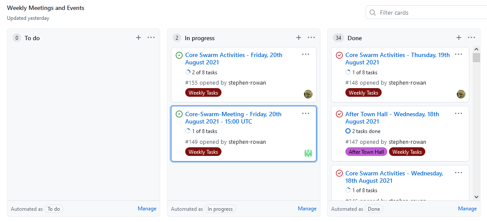
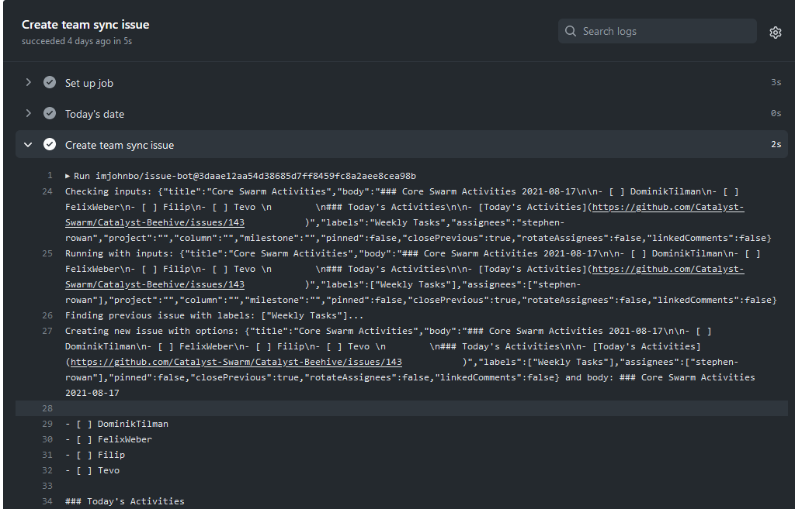

# Auditability Proposal - Distributed Auditability

| Title   | Project Catalyst Fund 6 - Auditability Challenge |
| ------- | ------------------------------------------------ |
| Subject | Distributed Auditability                         |

.png>)

| **Author**    | Stephen Whitenstall |
| ------------- | ------------------- |
| **Published** | 19/08/2021          |

Creative Commons Attribution

## **Ideascale link : **



## **Problem statement:**

No common audit standards in funded proposals.

No consistent evaluation of funded proposals.

Funded reporting is manual.

## **Describe your solution to the problem.**

Identify common community standards.

Incentivize and ease evaluation

Automate funded proposal reporting.

## **Relevant experience**

Stephen has 30 years' experience in organizing academic, community and business projects (See Detailed plan).

https://www.linkedin.com/in/stephen-whitenstall-166727210/

## **Website/GitHub repository (not required)**


GitHub Repo


## **Detailed Plan**

Build an automated distributed auditability system.

At its heart Project Catalyst is an experiment to develop distributed governance for the Cardano blockchain. So, meeting the challenge to improve and grow auditability requires a distributed approach. An effective and equitable distribution of auditability will require connections between the funded proposer and the community to be established, the communal development of transparent audit methods and constant iteration.

### Roadmap

### The present – Fund 5 QA-DAO proposal and community collaborations.

In August 2021 the QA-DAO proposal was successful in receiving votes and was funded. This confirmed that voters wish to see Quality Assurance Implemented in Project Catalyst and provides support for this proposal.

This Fund 6 Auditability proposal will draw upon the successful Fund 5 Developer ecosystem proposal for research and its path through the proposal process will be tracked and documented as per the previous proposal.

### Phase 0 : Research and prototyping – present to November 2021

### 0.1 Research

How different teams and individuals report the progress of their funded proposals will be researched. This will be done in collaboration with the funded cohort, IOG and Catalyst ecosystem toolmakers.

The initial intention of the Fund 5 - QA-DAO proposal is to examine how the Fund 5 - Developer Ecosystem  cohort reports its progress.&#x20;

### 0.2 Prototyping

Stephen provides support to Catalyst Swarm by documenting and tracking it's activities. This has been done continuously since 7th July 2021 by raising GitHub issues that track Core Swarm Activities such as meetings, After Town Halls, events (Idea Fest) and Saturday Swarm Sessions.

The ongoing experience of working with a widely distributed team working on many different projects has led to developing automation solutions such as Issue templates and forms. This is now being extended by using Continuous Integration tools such as GitHub Actions.

### 0.3 Auditability Workflows

The data from funded cohort reporting and qualitative research (into how reporting varies) will inform the design of auditability workflows. An auditability workflow will model the working practices of participants, the metrics they report on, whether this fit into their own documentation and how they might benefit from automation.

### Phase 1 - Funded Proposal - November 2021 to February 2022

### 1.1 Auditability Workshops

Once funded Distributed Auditability will offer or participate in workshops with the funded cohort on discovering their workflows and examining how these may be documented, reported on and automated. This part of the proposal may be offered in collaboration with a community F6: DLT Entrepreneurship Toolbox proposal.

### 1.2 Continuous Integration Development

Building on Core Swarm prototypes from Phase 0 specific auditing workflows will be automated using GitHub Actions.

## **Estimated cost**:

TBA

\
**Requested funds in USD:**
---------------------------

TBA
