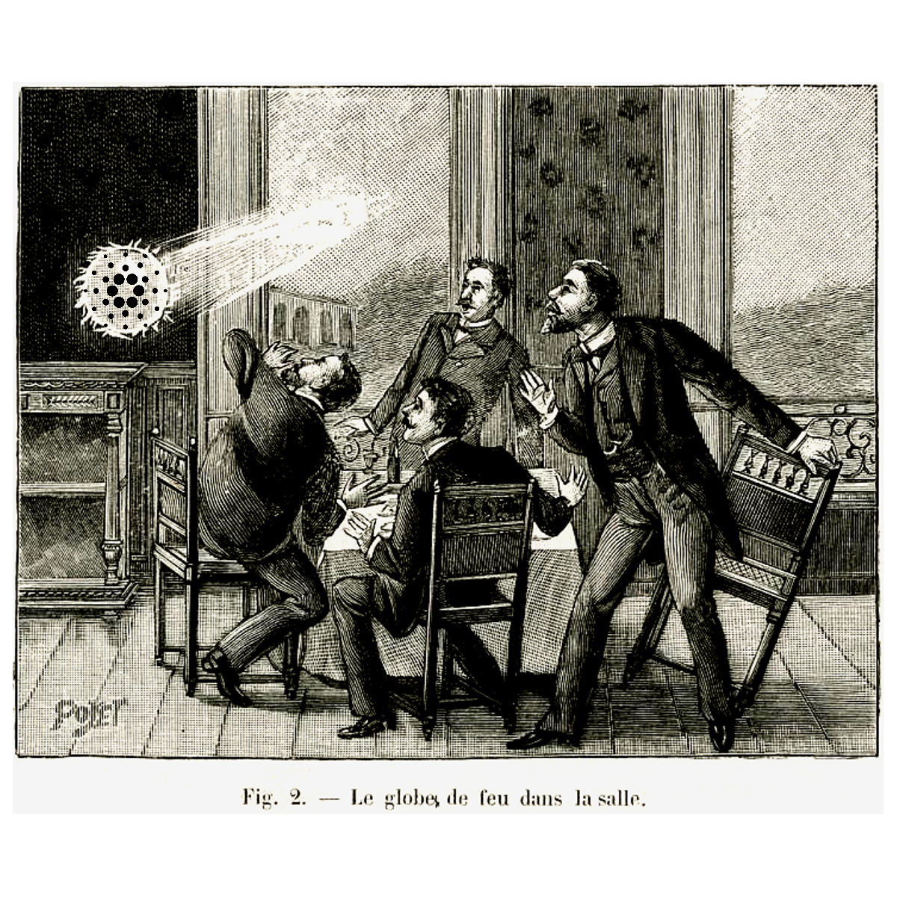

# Fund 6, Insight Sharing - Distributed Auditability

| Title | Project Catalyst Fund 6 |
| :--- | :--- |
| Subject | Insight Sharing - Distributed Auditability |

| Author | Stephen Whitenstall |
| :--- | :--- |
| Published | 15/08/2021 |
| Version | 1 |
| Revision | 0 |

Creative Commons Attribution

## Introduction

The insight-sharing phase of Project Catalyst Funds allows people to share their perspectives on the challenges in a Catalyst funding round before proposals are launched. This phase allows the community to brainstorm Challenge subjects and to inspire and inform proposers.

Insight-sharing specifically asks:

* What gaps do you see in how this challenge is currently addressed?
* How can we improve the challenge brief?
* What wild thoughts do you have about how to best address this challenge?

The insights shared here all concern the auditability of Project Catalyst funded proposals. And I seek to demonstrate that auditability problems and solutions are applicable in many different challenges. Each with their own context and specific issues.

## F6: Improve and Grow Auditability



#### $100,000 in ada


How to make the auditing process of funded proposals efficient, distributed, and transparent?


### Insight: Distributed Auditability

#### Description

Project Catalyst Funded Proposals have no consistent reporting of what they intend to deliver or how budgets are being spent. Reporting information is presented in a variety of formats, and this inhibits the general ADA holder/voter from easily assessing progress and quality of delivery.

### Access to and use of fund data



Access to how often projects get funded and the total funding amount spent is expected in the next few months \(via Fund 5 “[Catalyst Site: Project tracking](https://cardano.ideascale.com/a/dtd/350699-48088)”\). But this data requires careful analysis and needs to be supplemented with specific metrics on how a funded proposal’s budget is spent and what stages have been achieved. It is also necessary to communicate the state of a funded proposal as widely as possible and in an accessible, consistent format.

###  Networks of trust and reputation



The de facto situation relies to a large extent on an informal network of trust and reputation. Consequently there is a significant amount of qualitative judgment, even where quantitative assessments are possible.

Such an informal network risks introducing unwarranted assessments of trust and reputation. Community assessments and ultimately the decisions of voters may rest merely on past associations. There is the danger that after a few funding rounds such an informal network begins to establish itself as a permissioned culture that draws on a permissionless chain.

### Matching the quality approach of IOHK



The challenge then is to raise the bar of quality in Project Catalyst to a level of maturity that ultimately matches the quality approach of IOHK with its peer-reviewed research and evidence-based methods. So, a high level of quality assurance becomes integral to the success and reputation of a funded proposal.

### Distributed Auditability



At its heart Project Catalyst is an experiment to develop distributed governance for the Cardano blockchain. So, meeting the challenge to improve and grow auditability requires a distributed approach. An effective and equitable distribution of auditability will require connections between the funded proposer and the community to be established, the communal development of transparent audit methods and constant iteration.

### Qualitative and quantitative measures

Distributed Auditability also needs to take account of both qualitative and quantitative measures of a funded proposal’s success. Whilst quantitative reporting can be largely automated, qualitative assessments require engagement between proposers and the community.

### Insight: Auditability & Challenge Teams



#### Description

The announcement of “Challenge Teams” at the Catalyst Town Hall of 11th August 2021 \(Catalyst Fund6 Townhall \#1\) introduces a new dimension to this auditability challenge. This circumstance opens the possibility of funding to provide ancillary support for Challenge teams.

This audibility challenge may also inform how Challenge Teams should be structured. Such as including some input from those who supported and voted for the presentation of the challenge. This would ameliorate the risk of introducing a Challenge "closed shop".

There is massive potential in Challenge Teams leading by example. By making it desirable to demonstrate quality, by distributing knowledge and expertise.

## F6: Developer ecosystem - In Draft



#### $1,005,000 in ada


How can we create a positive developer experience that helps the developer focus on building successful apps?


### Insight : Auditability of the Developer ecosystem. In Draft

### Description

Auditability in the context of the Developer ecosystem challenge is a natural complement to its positive success metrics. Well-documented and tracked projects provide value to other developers in the Cardano community, reduce duplication of effort, contribute to a lively open-source culture on GitHub and provide assurance to enterprise dev managers that a project is scalable.

The treasury for this challenge has increased from $600,000 to $1,005,000 in ada.

Support for quality assurance of Developer ecosystem proposals was demonstrated in Fund 5 when my own proposal Quality-Assurance DAO was voted for.

## F6: Distributed decision making - In Draft



#### $75,000 in ada

How can we help the Catalyst community to get better at distributed decision making within the next two Catalyst rounds?

### Insight Title : Auditability of Distributed decision making.

### Description

## 

## F6: Proposer outreach - In Draft

$100,000 in ada

How can we encourage entrepreneurs from outside the Cardano ecosystem to submit proposals to Catalyst in the next two funds?

### Insight : Auditability of Distributed decision making.

### Description

## 

## F6: Catalyst value onboarding  - In Draft

$75,000 in ada

How can we encourage meaningful participation in Project Catalyst from community members in the next two funds?

### Insight Title : Auditability of Catalyst value onboarding

### Description

## F6: Metadata challenge  - In Draft

$100,000 in ada

How can we utilize transaction metadata to solve real world problems?

### Insight : Auditability of Metadata challenge

### Description

## F6: NFT Business models

$200,000 in ada

What non-Art use cases of NFTs can distinguish Cardano as the blockchain of choice for NFT based businesses?

### Insight : Auditability of NFT Business models

### Description

To succeed NFT Business models need to assure their customers and clients of their own quality, reliance, robustness, and track-record.

To achieve this outcome any NFT Business model proposal should be ready to demonstrate:

A transparent legal status that assures customers and clients of liabilities and where responsibility lies for business delivery.

A clear commitment to Cardano values \(as the blockchain of choice\) of connectedness, transparency, and fairness.

A well-documented, maintained and tracked system of governance. So that clients and customers may have a clear understanding of why, when, and how business decisions are made.

An unambiguous apportion of intellectual property so that clients and customers know their data is safe.

