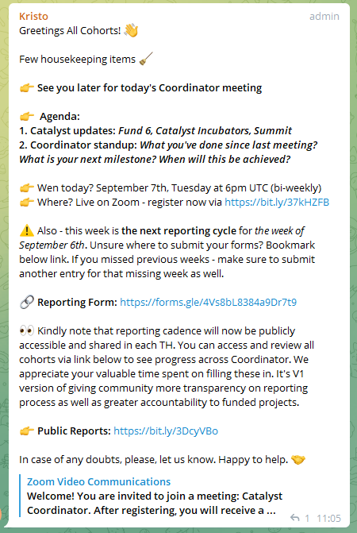

# Fund 5, Developer Ecosystem Proposal - Governance

## Overview

This section reports the progress of the **Fund 5 - Quality Assurance DAO** project as it documents and assesses the **Fund 5 Governance process**. This will include documentation of :

* The pathway of a funded cohort and 
* An assessment of funded cohort reporting requirements.

## Cohort On-boarding - Email Survey

| Question | Answer |
| :--- | :--- |
| **Ideascale Project Title** | Quality Assurance DAO |
| **Short Description of Project** | QA Assessment of Catalyst Proposal Process. |
| **Specific Industry** | Quality Assurance / Information Technology |
| **End users** | Project Catalyst Voters, Community, Proposers, Implementers and Community Advisors. |
| **No. Member\(s\)** | 1 |
| **Implementation Date** | 29/09/2021 - Change to November 2021 |
| **Link to Ideascale Proposal** | [https://cardano.ideascale.com/a/dtd/Quality-Assurance-DAO/351678-48088](https://cardano.ideascale.com/a/dtd/Quality-Assurance-DAO/351678-48088) |
| **Ideascale Username** | @swhitenstall |
| **Which challenge were you successful in ?** | Developer Ecosystem |
| **Were you previously successful in any of the past funding rounds? Like Fund1, 2, 3,4?** | No |
| Last Name | Whitenstall |
| First Name | Stephen |
|  |  |

## Cohort Report \#1

#### Cohort Progress Report 

#### Catalyst Coordinator reporting 

**Email**  _****swhitenstall@googlemail.com_ 

_**Your Full Name**_  Stephen Whitenstall 

### Proposal Name  _Proposal name must match your Ideascale title_ 

_Quality-Assurance-DAO_ 

### _Describe two significant successes you had this month and what you learned from each._ 

_Your answer will not be shared with the public. Text box will expand as you type._  

Meeting with other Fund 5 Cohort members agreed to collaborate on sharing Catalyst Fund data and progress with IOHK. Began tracking Fund 5, Developer Ecosystem Proposal - Governance \([https://stephen-rowan.gitbook.io/quality-assurance-dao/catalyst-proposals/fund-5-developer-ecosystem-proposal-governance](https://stephen-rowan.gitbook.io/quality-assurance-dao/catalyst-proposals/fund-5-developer-ecosystem-proposal-governance) \) 

### Describe two significant setbacks, obstacles, or failures you had this month and what you learned from each \(regardless of whether or not you solved them\).

_Y_our answer will not be shared with the public. Text box will expand as you type.  __

_Lack of response from IOHK by email on changes to onboarding data and Collaboration with IOHK. I learnt that email might not be the most effective way to contact IOHK - will try Telegram. Also aware that this is a very busy time for IOHK._ 

### _Is your Proposal in Fund2, Fund3, Fund4 or Fund5?_  

Fund5

### Which Challenge is your Proposal in?  __

_F5: Developer Ecosystem_

### _Fund5: Developer Ecosystem - Reporting Project Launch Date?_  Actual or Projected Launch Date 

DD 11 / MM 04 / YYYY 2021 

### Has your Project Launched?  __

_Yes_

### _Launched F5 Developer Ecosystem - Progress_ 

_These metrics should be reported for just this reporting cycle, not Cumulative._ 

### _How many developers did your proposal engage?_  

34 in April 2021 Open Source Survey 

### Thanks to your proposal, How many developers were successfully onboarded to develop software on top of Cardano? \* 

Uncertain 

### Did anyone from the community provide you help? Give a shoutout to those who deserve it.

Everyone involved with the Open Source Survey \( [https://github.com/Quality-Assurance-DAO/F5-Developer-ecosystem-Proposal/issues?q=is%3Aopen+is%3Aissue+label%3A%22FeedbackChallenge+%3A+Open+Source%22](https://github.com/Quality-Assurance-DAO/F5-Developer-ecosystem-Proposal/issues?q=is%3Aopen+is%3Aissue+label%3A%22FeedbackChallenge+%3A+Open+Source%22)\). I will provide a more accessible summary in "Feedback Challenge : Open-Source Assessment Report". 

### Any other metric to share about outcomes? 

Metrics and Reporting on Governance outcomes depends upon collaboration with IOHK. As I wish to document and report on 1\) The pathway of a funded cohort and 2\) An assessment of funded cohort reporting requirements. 

### Any status report you would like to share? 

Governance of the Quality-Assurance DAO , Fund 5, Developer Ecosystem Proposal is being documented in this section of the QA-DAO GitBook \([https://stephen-rowan.gitbook.io/quality-assurance-dao/catalyst-proposals/fund-5-developer-ecosystem-proposal-governance](https://stephen-rowan.gitbook.io/quality-assurance-dao/catalyst-proposals/fund-5-developer-ecosystem-proposal-governance) \). I will try to align my reporting to the biweekly schedule.

## Cohort Meeting \#2 - September 7th, 2021

Greetings All Cohorts! 👋

Few housekeeping items 🧹

👉 See you later for today's Coordinator meeting

👉 Agenda: 1. Catalyst updates: Fund 6, Catalyst Incubators, Summit 2. Coordinator standup: What you've done since last meeting? What is your next milestone? When will this be achieved?

👉 Wen today? September 7th, Tuesday at 6pm UTC \(bi-weekly\) 👉 Where? Live on Zoom - register now via [https://bit.ly/37kHZFB](https://bit.ly/37kHZFB)

⚠️ Also - this week is the next reporting cycle for the week of September 6th. Unsure where to submit your forms? Bookmark below link. If you missed previous weeks - make sure to submit another entry for that missing week as well.

🔗 Reporting Form: [https://forms.gle/4Vs8bL8384a9Dr7t9](https://forms.gle/4Vs8bL8384a9Dr7t9)

👀 Kindly note that reporting cadence will now be publicly accessible and shared in each TH. You can access and review all cohorts via link below to see progress across Coordinator. We appreciate your valuable time spent on filling these in. It's V1 version of giving community more transparency on reporting process as well as greater accountability to funded projects.

👉 Public Reports: [https://bit.ly/3DcyVBo](https://bit.ly/3DcyVBo)

In case of any doubts, please, let us know. Happy to help. 🤝

Zoom Video Communications \([https://bit.ly/37kHZFB](https://bit.ly/37kHZFB)\) Welcome! You are invited to join a meeting: Catalyst Coordinator. After registering, you will receive a confirmation email about joining the meeting.

