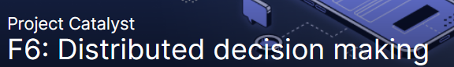

# Distributed decision making - Oversight of Catalyst Circle

| Title | Project Catalyst Fund 6: Distributed decision making |
| :--- | :--- |
| Subject | Oversight of Catalyst Circle |

| **Author** | Stephen Whitenstall |
| :--- | :--- |
| **Published** | 01/09/2021 |
| **Version** | Alpha Version 1.0 |

Creative Commons Attribution

## Problem statement :

A community maintained oversight of Catalyst Circle requires support to be sustainable.

## Describe your solution to the problem

Resource an active site that documents the activities of the Catalyst Circle

## Relevant experience \(identifying information\)

Stephen has 30 years' experience in organizing academic, community and business projects 

### Website/GitHub repository \(not required\)



## Detailed plan \(not required\) - Fill in here any additional details

## **Presentation / tracking**

A more readable GitBook version of this proposal can found [here](https://stephen-rowan.gitbook.io/quality-assurance-dao/fund-6-proposals/distributed-decision-making-oversight-of-catalyst-circle). 

The text of this proposal is version controlled [here ](https://github.com/Quality-Assurance-DAO/F6-Distributed-decision-making-Oversight-of-Catalyst-Circle/blob/main/Proposal/F6-Distributed-decision-making-Oversight-of-Catalyst-Circle.md)and tracked [here ](https://github.com/Quality-Assurance-DAO/F6-Distributed-decision-making-Oversight-of-Catalyst-Circle/projects/1).

### Community Oversight

The Catalyst Circle Oversight GitBook documents and tracks the activities of the Catalyst Circle a initiative started by IOHK to advance governance in Project Catalyst.

This site is maintained by QA-DAO in collaboration with the Cardano and Project Catalyst communities. All content recorded is open source, licensed under Apache 2.0.

The Catalyst Circle Oversight GitBook has been maintained since July 11th 2021.

### Relevant experience

Stephen Whitenstall: Stephen Whitenstall has 30 years' experience in organizing academic, community and business projects. He develops, maintains documentation and provides technical project management support for Catalyst Swarm. As QA-DAO he tracks and documents the Catalyst Circle and maintains 'Ekphrasis' a repository of academic content from across the Cardano community. 



### A live record of additions to the GitBook

A live record of additions to the GitBook back end GitHub repository can be seen here :  



### Tracking the time spent on maintaining the GitBook

QA-DAO \( [https://stephen-rowan.gitbook.io/quality-assurance-dao/](https://stephen-rowan.gitbook.io/quality-assurance-dao/) \) has been tracking the time spent on maintaining the GitBook. 

The raw Clockify data to 30th August 2021 can be found here : 



A total of 27:40 hours have been spent to the 30th August 2021. Approx 18 hours were spent documenting and tracking in July 2021 and 9 hours in August 2021. More time was spent in July 2021 setting up the GitBook and documenting an extensive problem sensing exercise conducted by Catalyst Circle.

A shift to note-taking on a proprietary platform inhibited documentation and tracking for Circle Meetings 3 and 4. More time may be allocated in September 2021 to resolve this issue. Documented here \( Barriers to tracking and documenting the content of Catalyst Circle Meetings - [https://github.com/Catalyst-Swarm/Catalyst-Circle-Co-ordination/issues/20](https://github.com/Catalyst-Swarm/Catalyst-Circle-Co-ordination/issues/20)\)\) and discussed here \([https://catalyst-swarm.gitbook.io/catalyst-circle/commentary/commentary-on-catalyst-circle](https://catalyst-swarm.gitbook.io/catalyst-circle/commentary/commentary-on-catalyst-circle) \)

### Weekly Breakdown

| Week beginning | Event\(s\) | Hours Worked |
| :--- | :--- | :--- |
| Monday 12th July 2021 | [Circle Meeting 1 - July 12th, 2021](https://catalyst-swarm.gitbook.io/catalyst-circle/meetings/meeting-1-july-12th-2021) | 06:40 |
| Monday 19th July 2021 | [Toolmakers and Maintainers problem sensing](https://catalyst-swarm.gitbook.io/catalyst-circle/toolmakers-and-maintainers/activity#t-and-m-problem-sensing-1) | 08:25 |
| Monday 26th July 2021 | [Toolmakers and Maintainers problem sensing](https://catalyst-swarm.gitbook.io/catalyst-circle/toolmakers-and-maintainers/activity#t-and-m-problem-sensing-4) | 02:58 |
|  | [Community Advisor Problem Sensing](https://catalyst-swarm.gitbook.io/catalyst-circle/community-advisors/community-advisor-activity) |  |
|  | [Circle Meeting 2 - July 29th, 2021](https://catalyst-swarm.gitbook.io/catalyst-circle/meetings/meeting-2-july-29th-2021) |  |
| Monday 2nd August 2021 |  | 03:24 |
| Monday 9th August 2021 | [Circle Meeting 3 - August 12th, 2021](https://catalyst-swarm.gitbook.io/catalyst-circle/meetings/meeting-3-august-12th-2021) | 02:15 |
|  |  |  |

#### 

#### Monday 9th August 2021 - 02:15 hours

Circle Meeting 3 - August 12th, 2021

[https://catalyst-swarm.gitbook.io/catalyst-circle/meetings/meeting-3-august-12th-2021](https://catalyst-swarm.gitbook.io/catalyst-circle/meetings/meeting-3-august-12th-2021)

#### Monday 16th August 2021 - 00:44 hours

#### Monday 23rd August 2021 - 02:17 hours

Meeting 4 - August 26th 2021

[https://catalyst-swarm.gitbook.io/catalyst-circle/meetings/meeting-4-august-26th-2021](https://catalyst-swarm.gitbook.io/catalyst-circle/meetings/meeting-4-august-26th-2021)

CA & vCA Rewarding Model - 27th August 2021

[https://catalyst-swarm.gitbook.io/catalyst-circle/community-advisors/community-advisor-activity\#27th-august-2021-ca-and-vca-rewarding-model-project-catalyst-fund-6](https://catalyst-swarm.gitbook.io/catalyst-circle/community-advisors/community-advisor-activity#27th-august-2021-ca-and-vca-rewarding-model-project-catalyst-fund-6)

#### Monday 30th August 2021 - 00:55 hours

#### Total hours to date : 27:40

## Checklist

* Received emails from [communications@iohk.io](mailto:communications@iohk.io)
* Submitted this proposal to only one challenge
* Included identifying information about all proposers

## Which of these definitions apply to you? Developer, Teacher, Other/Prefer not to say

