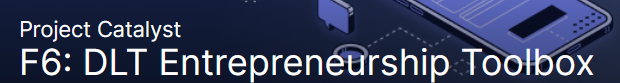

# DLT-Entrepreneurship-Toolbox Open Source Training

| Title | Project Catalyst Fund 6 DLT-Entrepreneurship-Toolbox |
| :--- | :--- |
| Subject | Open Source Training |

| **Author** | Stephen Whitenstall |
| :--- | :--- |
| **Published** | 25/08/2021 |
| **Version** | Alpha Version 1.0 |

Creative Commons Attribution

## **Fund 6 Proposal**

## **Problem statement:**

No open-source training materials in the Entrepreneurship-Toolbox

Lack of structure in entrepreneurial use of open-source infrastructure.

## **Describe your solution to the problem.**

Provide open-source training materials for the Entrepreneurship-Toolbox

Provide a structured approach to open-source infrastructure that will empower early entrepreneurs.

## **Relevant experience**

Stephen has 30 years’ experience in organizing academic, community and business projects.

https://www.linkedin.com/in/stephen-whitenstall-166727210/

## **Website/GitHub repository \(not required\)**


 [https://stephen-rowan.gitbook.io/quality-assurance-dao/fund-6-proposals/dlt-entrepreneurship-toolbox-open-source-training](https://stephen-rowan.gitbook.io/quality-assurance-dao/fund-6-proposals/dlt-entrepreneurship-toolbox-open-source-training)


## **Detailed Plan**

**Revisiting the Problem Statement**

Project Catalyst is rapidly expanding, and its decentralized funding platform needs to support industry standard collaborative coding, tracking and documentation tools such as GitHub. 1000s of Cardano developers use version control tools such as GitHub, but there is often a gap in knowledge for entrepreneurs who do not take advantage of GitHub's organisational and collaborative features.

**Introducing the Solution**

In partnership with the Catalyst School – QA-DAO will offer introductory training materials for entrepreneurs to take advantage of open-source tools such as GitHub.

This will provide a series of workshops comprising of a short screencast, screen share and Q&A on the use of GitHub in Project Catalyst projects.

The direction of the workshops will aim to discover participants workflows and examine how these may be documented, reported on, and automated using GitHub. This part of the proposal is offered in collaboration with F6: Improve and Grow Auditability : Distributed Auditability \( [https://cardano.ideascale.com/a/dtd/Distributed-Auditability/366707-48088](https://cardano.ideascale.com/a/dtd/Distributed-Auditability/366707-48088) \)

**Relevant experience \(identifying information\)**

Stephen Whitenstall: Stephen Whitenstall has 30 years' experience in organizing academic, community and business projects. He develops, maintains documentation and provides technical project management support for Catalyst Swarm. As QA-DAO he tracks and documents the Catalyst Circle and maintains 'Ekphrasis' a repository of academic content from across the Cardano community.

[https://www.linkedin.com/in/stephen-whitenstall-166727210](https://www.linkedin.com/in/stephen-whitenstall-166727210)

**Roadmap \( Definition of success after 3, 6 and 12 months\)**

**Prior to funding**

In collaboration with the Catalyst School – QA-DAO will develop introductory training materials for entrepreneurs to take advantage of open-source tools such as GitHub.

---------------------------------------------------------------------------------------------------------

**3 months \(November 2021 to January 2022\)**

Once funded QA-DAO will offer introductory training materials for entrepreneurs to take advantage of open-source tools such as GitHub.

**Provisional\* Schedule of workshops**

- Workshop 1 - Saturday, November 13th 2021

- Workshop 2 - Saturday, November 20th 2021

- Workshop 3 - Saturday, November 27th 2021

- Workshop 4 - Saturday, December 4th 2021

- Workshop 5 - Saturday, December 11th 2021

- Break

- Workshop 6 - Saturday, January 8th 2022

- Workshop 7 - Saturday, January 15th 2022

- Workshop 7 - Saturday, January 22nd 2022

\* Some workshops may be rescheduled to accommodate Idea Fest or Hackathons etc.

---------------------------------------------------------------------------------------------------------

**6 months \(February 2022 to April 2022\)**

Screencasts and Workshop recordings will be available on Youtube

Course documentation will be available on GitBook and GitHub and can be updated via pull requests and/or issues.

---------------------------------------------------------------------------------------------------------

**12 months \(May 2022 to October 2022\)**

Screencasts and Workshop recordings will be available on Youtube

Course documentation will be available on GitBook and GitHub and can be updated via pull requests and/or issues.

**Budget**

**Workshops**

8 Workshops each with 6 hours preparation and 2 hours duration

= 64 hours

**Youtube**

8 Screencasts each with 2 hours preparation

= 16 hours

8 Youtube Session recordings – editing and timestamps

= 64 hours

**Course Documentation and presentation**

8 sections with 8 hours preparation each \(1 for each workshop\)

= 64

**Total Hours = 208**

$ 40 per hour

**Total = $ 8320**

##  **Requested funds in USD:**

**$ 8320**

