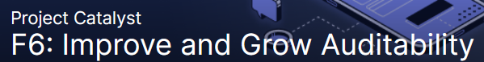
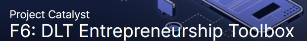
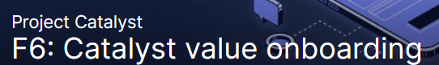
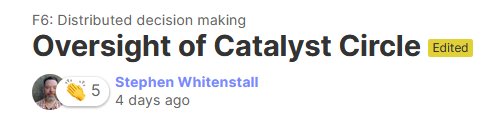

# Fund 6 - Summary

## Improve and Grow Auditability - Distributed Auditability

### Ideascale



### GitHub Repository



### Summary

## Scale-UP Cardano's Community Hubs - Homeless Hub

### Ideascale



### Summary

## DLT Entrepreneurship Toolbox - Open Source Training

### Ideascale



### GitHub Repository



#### Summary

## Catalyst value onboarding Ekphrasis - Academic GitBook

### Ideascale



### GitHub Repository



### Summary

## Distributed decision making - Oversight of Catalyst Circle

### Ideascale



### Summary

## Fund7 challenge setting - Equip Socially Excluded Communities

#### Ideascale



#### Summary

