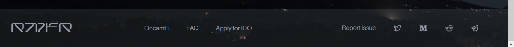

# OccamFi OCC IDO



.jpeg>)

Curb brokers in Wall Street, New York City,1920

Bain News Service, Public domain, via Wikimedia Commons

| **Author**    | Stephen Whitenstall          |
| ------------- | ---------------------------- |
| **Published** | 12/05/2021                   |
| **Version**   | For Community Review 1.0     |
| **Licence**   | Creative Commons Attribution |

| **Distribution (Alphabetical order)** |                                 |
| ------------------------------------- | ------------------------------- |
| Aldea (Catalyst Proposal)             | Aldea Discord Server            |
| Liqwid Finance (Catalyst Proposal)    | Liqwid Finance Discord Server   |
| NFT-DAO (Catalyst Proposal)           | NFT-DAO Discord Server          |
| OccamFi                               | OccamFi Discord Server          |
| Project Catalyst                      | Project Catalyst Discord Server |
| Innovatio (Catalyst Proposal)         | Innovatio Discord Server        |

## Overview

The purpose of this study is to:

1 – Document and communicate with the Catalyst Community the launch of a token that aims to bridge the Ethereum and Cardano blockchains.

2 – Provide a detailed timeline of a Token launch to inform future strategy, development, and testing in other Catalyst proposals (particularly Token launches).

3 – Assess with the Catalyst Community how different financing models such as outside Venture Capital, in contrast to Project Catalyst funding, may impact the reception of a token launch.

4 – Build an open-source Token Launch Risk Model.

## Scope

This study examines the period between **March 29th** and **April 14th, 2021** when OccamFi announced and released an “Initial Distribution Offer” (IDO) of a token called OCC intended to bring capital liquidity to Cardano via OccamFi’s DEFI LaunchPad.

The roadmap for OccamFi’s LaunchPad is to build a DEX and Capital Markets on its launchpad and progress towards a single governance layer which aims to be a distributed autonomous organisation (DAO).

OccamFi’s web hosted platform is called OccamRazor. The OccamRazor web platform has an overview and detailed section that displays its OCC offering and links to Metamask wallet for transactions.

Some online content will have changed since this study’s publication.

## Prelaunch Timeline Summary

OccamFi began to market its OCC launch to the public from **March 29th, 2021** with a “_Ready for DEFI on Cardano_” announcement on its Twitter feed. Followed by details of OccamFi’s Ethereum to Cardano liquidity bridge on March 30th, 2021.

On **April 1st, 2021**, OccamFi shared information about OCC’s token private investment round and confirmed that participation from leading tech venture capital (VC) firms had concluded. The completion of VC funding led to the opportunity to buy OCC through OccamFi’s public offering on its LaunchPad OccamRazor.

From the outset OccamFi’s announcements attracted commentary from the Cardano community. The reaction to the private VC funding touched upon Cardano’s culture of transparency, accessibility, and community involvement.

Some community distrust was evident in a perception of privileged token pre-allocations.

Responses to OccamFi’s Medium article “_Analysing the Funding Landscape of Cardano_” of the **April 3rd, 2021** requested additional information on a “tiered system for guaranteed participation” which was not immediately forthcoming.

On **April 5th, 2021** OccamFi announced an Ambassador beta testers programme which received a positive response from the community. Although no test data has been made available as OccamFi are not an open-source company.

On the same day Mark Berger, President of Occam Association appeared in an interview with the _Cardano Live_ YouTube Podcast. Mark framed OccamFi’s ETH launchpad as “…_to go from 0 to 1 to attract developers and users, and Cardano to go from 1 to 100_.”

The Chat replay response to the interview highlighted the risk of sniping trading bots and requested further information on the nature of Venture Capital access to the launchpad.

On **April 7th, 2021** OccamFi introduced its Occam Association team and Advisors. The response to this announcement was positive, although further information was requested on the development team.

Other collaborations were announced on April 8th with Moonrock Capital, on **April 9th** with Chris Graffagnino, on **April 10th** with Bakyt Azimkanov and on **April 11th** with Tiago Serôdio.

On **April 11th**, OccamFi presented a first outline of OCC tokenomics in a Medium article. This broke down into 5 key areas. 1. Access to Liquidity Mining Pools, 2. Access to Private Liquidity Pools 3. OccamDAO investments — Continuous Ecosystem Diversification, 4. Pool origination and 5. Cast Out Tokenomics. Responses to the article were mixed with some supporting a strategy of extracting liquidity from Ethereum. While others were sceptical of the risk associated with ERC20 tokens on the Ethereum platform.

## OCC Launch Timeline Summary

The day of the launch, **14th April**, started at **2.30pm** (UTC) with a timer announcing, “_Get ready for the moment we've all been waiting for!_”

Among responses there was some confusion over where to buy the tokens, whether US citizens could participate and reports of the website being down.

At **5:30 PM** (UTC), OccamFi announced that “_The long-awaited moment has finally arrived._” The OCC IDO was Live.

The response to this tweet were numerous and mostly negative.

Complaints included:

* The IDO was sold out in less than 5 minutes.
* The website was down or inaccessible on mobile platforms.
* Wasted ETH transaction fees.

At **5:31 PM** (UTC) OccamFi tweeted a link to their FAQ “_A step-by-step guide to participating in our IDO_” on their GitBook.

The negative responses to this tweet continued.

Complaints included:

* The expense of participating (one person cited a minimum buy of 0.08 ETH costing $168 plus fees).
* The website was down or inaccessible on mobile platforms.

At **5:43 PM** (UTC), OccamFi tweeted out the suggestion to “_Please refresh the page_” to connect to the MetaMask Wallet.

The negative responses to this tweet continued.

Complaints included:

* The website incorrectly identifying desktop/laptops as mobile platforms.
* The effective exclusion of mobile platforms due to downtime.
* The instantaneous sell-out.

At **5:57 PM**, OccamFi tweeted out the announcement that the “IDO sold out in under 30 seconds” and directed buyers to Uniswap.

The negative responses to this tweet continued.

Complaints included:

* The observation that the OccamFi web platform did not work rather than was sold out.
* High fees on Uniswap.
* Messages being ignored on Telegram.

At **6.00 PM** (UTC), OccamFi tweeted out a link to their GitBook on how to “Claim your tokens”.

The negative responses to this tweet continued.

Complaints included:

* Criticism of the distribution model. That only 175 people were able to claim IDO tokens.
* Immediately following an IDO with a Uniswap listing.

At **6.13 PM** (UTC), OccamFi tweeted out an image of people jumping in air with joy, thanking people and citing “_unprecedented levels of participation_.

OccamFi provided the information that “_almost 100k users_” tried to access the IDO which was sold out in under 30 seconds.

This tweet was received particularly poorly.

Complaints included:

* The tweeted image appeared to celebrate a failure and trivialised the frustrations of those unable to access the IDO.
* Frustration with Telegram support directing users to the FAQ.

Two and half hours later, at 9:37 PM (UTC), OccamFi tweeted out the message that “_We understand that some of you were frustrated_”, with a link to a Medium article entitled “_An Open Letter to the Occam.fi and Cardano Community from the Occam Association_”.

Responses to this article were mostly negative.

Complaints included:

* Why only 0.02 % of the IDO was offered to the public.
* Messages being deleted on Telegram.

The timeline ends here.

## OccamFi

### Online Presence:

#### Website:

[https://occam.fi/](https://occam.fi)

OccamFi has a straightforward one-page website that offloads it content across Telegram, Medium, Twitter, Instagram, Reddit and GitBook.

Also, on the website is:

A link to **Deck** a pdf presentation of Occam Razor’s rationale in the DEFI landscape ([https://occam.fi/docs/occam_deck.pdf](https://occam.fi/docs/occam_deck.pdf)).

A link to the **OccamRazor Whitepaper** ( [https://occam.fi/docs/occamrazer_wp_v1.pdf](https://occam.fi/docs/occamrazer_wp_v1.pdf) ) which outlines the protocols capability to support financial instruments that utilise bonding curves, price, and auction mechanics, staking pools and engagement incentives such as bounty hunting and referral systems.

#### Telegram

A Telegram account at [https://t.me/occamfi](https://t.me/occamfi) provides regular announcements. Channel created 11th March 2021.

.png>)

#### Medium

[https://medium.com/occam-finance](https://medium.com/occam-finance)

.png>)

OccamFi has several articles on its Medium account. The earliest post is dated to March 29th, 2021. But not all articles are visible on the landing page (no earliest article link).

A notable post is “_An Open Letter to the Occam.fi and Cardano Community from the Occam Association_” ([https://medium.com/occam-finance/an-open-letter-to-the-occam-fi-and-cardano-community-from-the-occam-association-431177bc43e1](https://medium.com/occam-finance/an-open-letter-to-the-occam-fi-and-cardano-community-from-the-occam-association-431177bc43e1)). Which responded to criticisms of the OCC launch.

#### Twitter

OccamFi has an active Twitter account ([https://twitter.com/OccamFi](https://twitter.com/OccamFi)) with 17.7K Followers. Activated March 2021.

OccamFi also uses the semrush social-media-tool (https://www.semrush.com/features/social-media-tool/)

#### Instagram

At the time of writing, OccamFi has a holding page on Instagram [https://www.instagram.com/occamfi/](https://www.instagram.com/occamfi/) with 1 post, 451 followers and a website link.

#### Redditt

[https://www.reddit.com/user/OccamFi](https://www.reddit.com/user/OccamFi)

At the time of writing, OccamFi has a redditt page with 6 posts all posted around the beginning of April. The first post has its content removed by reddit’s spam filters.

The top post is headlined as “!!! SCAM ALERT !!!”

.png>)

#### GitBook FAQ:

[https://occam-fi.gitbook.io/occam-faq/-MY6AK8LDbVHXnVAsex9/](https://occam-fi.gitbook.io/occam-faq/-MY6AK8LDbVHXnVAsex9/)

OccamFi has comprehensive GitBook documentation that outlines their roadmap and motivations.

### **Open source and Auditing**

**OccamFi’s** our codebase and components are proprietary.

**OccamFi has the following statement about its open-source status and auditing in its GitBook FAQ:**

**Text reads: “Will this be open source? Will the smart contracts be formally verified?”**

_“As we originally mentioned in our Medium articles, we have already undergone a smart contract audit by ScalableSolutions and are in the process of undergoing another one with industry leader, CertiK._

_We believe transparency to be paramount, so we will make the audits publicly available as soon as they are ready. However, our codebase and components are currently proprietary, as our engineers have worked incredibly hard to build our platform, positioning us as a leading provider of liquidity and launchpad capabilities for the Cardano ecosystem.”_

**Note:** Scalable Solutions is also under the management of the Occam Association.

## The OccamRazor Platform

[https://razer.occam.fi/](https://razer.occam.fi)

### OccamRazor - Initial page

The initial OccamRazor platform page presents the “Featured” OCC Token offering status. There are links at the top of the page to the OccamFi website, Platform FAQ (GitBook https://occam-fi.gitbook.io/occam-faq/-MY6AK8LDbVHXnVAsex9/occamrazer-platform-faq) and an “Apply for IDO” form.

There is a link to the Metamask wallet.

A button indicates “Sold Out”.

With a ticker symbol indicating conversion between OCC/ETH.

1 ETH = 1,125 OCC and 1 OCC = 0.0008 ETH respectively.

A gauge indicates that a soft cap (minimum capitalisation) of 200,000 OCC has been achieved in the initial offering. A calendar icon to the right displays the data range of the offering as between April 14 and April 21st, 2021.

An unlocked padlock icon indicates that the liquidity pool is public to which anyone may participate.

An empty circle repre4sent 0 of 7 days left to participate.

A figures icon represents those who were able to take part as 175 participants.

### OccamRazor - Detailed view

.png>)

There is a link to the Metamask wallet.

The detailed view indicates:

1. The Access type as Public.
2. The minimum contribution as 0.08 ETH.
3. The IDO start date as April 14th, 2021.
4. The Soft cap as 100,000 OCC.
5. The maximum allocation as 1 ETH
6. The IDO end date as Apr 21, 2021
7. The Hard cap as 200,000 OCC.
8. And provides a Etherscan Address.

A Token section indicates:

1. The Token as OCC (OCC)
2. The Total Supply as 100,000,000 OCC
3. And provides a Etherscan Address.

An About section at the bottom describes the OccamFi team as:

“_We are a team of technologists, olympiad-winner mathematicians, reputable bankers, and eminent financial economists who came together with the goal of building next-generation DeFi applications on Cardano, that scale to accommodate the next wave of adoption_.”

And provides links to the Website, Wwhitepaper, Twitter, Telegram and Medium.

### Bottom Panel

**At the bottom of both webpage view is a panel**

**That provides links to the OccamFi website, FAQ, Apply for IDO, Twitter, Medium, Reddit and Telegram.**

**A “Report an Issue” link goes to OccamFi’s Telegram Service Desk**

### **OccamFi’s Telegram Service Desk**

 (1).png>)

**.**

### **OccamRazer Application Form**

The text reads :

“_OccamRazer Application Form_

_In order to submit your application for the OccamRazer launchpad, please fill out the form and we will make sure to get back to you as soon as possible. Note that our reliance upon a robust Due Diligence process requires quite a bit of information, therefore filling out this form may take a while.”_

## Social Media Timeline

**Note**: This timeline is presented “as is” and is meant to be illustrative of social media reactions to a Token launch for instructional purposes. As far as possible Twitter identities have been anonymized and a range of opinions have been selected. What is said on social media is treated as opinion.

The major source of news and engagement for the OCC launch is on OccamFi’s Twitter account supplemented by Medium Articles.

### March 29th, 2021

#### Ready for DEFI on Cardano

Ready for DEFI on Cardano (https://twitter.com/OccamFi/status/1376313910282817541)

Link to Medium Article. ( [https://medium.com/occam-finance/the-razers-edge-of-defi-arrives-on-cardano-1bf188361abc](https://medium.com/occam-finance/the-razers-edge-of-defi-arrives-on-cardano-1bf188361abc))

### March 30th, 2021

#### #Ethereum to [#Cardano](https://twitter.com/hashtag/Cardano?src=hashtag_click) liquidity bridge.

Tomorrow, we will reveal the first details of our unique [#Ethereum](https://twitter.com/hashtag/Ethereum?src=hashtag_click) to [#Cardano](https://twitter.com/hashtag/Cardano?src=hashtag_click) liquidity bridge.

([https://twitter.com/OccamFi/status/1377004274715086849](https://twitter.com/OccamFi/status/1377004274715086849))

### March 31st, 2021

#### Press Release (a paid press release)

https://cointelegraph.com/press-releases/occamrazer-the-first-defi-launchpad-for-cardano

### April 1st, 2021

#### the [#OCC](https://twitter.com/hashtag/OCC?src=hashtag_click) token private investment round.

Many of you asked about the [#OCC](https://twitter.com/hashtag/OCC?src=hashtag_click) token private investment round. We're pleased to share that this has already concluded, with participation from leading [#tech](https://twitter.com/hashtag/tech?src=hashtag_click) VC firms. Opportunity to buy OCC will come through our public offering. More details soon! [#venturecapital](https://twitter.com/hashtag/venturecapital?src=hashtag_click) [#ADA](https://twitter.com/hashtag/ADA?src=hashtag_click) [#Cardano](https://twitter.com/hashtag/Cardano?src=hashtag_click)

(https://twitter.com/OccamFi/status/1377708559056703494)

**Responses:**

“_How about opening the data of what percentage was bought by VCs, the lack of transparency does not seem to me to be a fair launch. The Cardano community is used to transparency_.” - April 2nd, 2021

“_Private sales.... Not what Cardano is all about. I hope this is a Aprils fools. If not, Go to Tron or the rainbow crew. Cardano needs openness and accessibility for all. Actors doing shady backyard sales belongs in the present._ [_#missedthepoint_](https://twitter.com/hashtag/missedthepoint?src=hashtag_click) [_#ADA_](https://twitter.com/hashtag/ADA?src=hashtag_click) [_#CardanoCommunity_](https://twitter.com/hashtag/CardanoCommunity?src=hashtag_click) [_#CARDANO_](https://twitter.com/hashtag/CARDANO?src=hashtag_click) “- April 1st, 2021

_“Can’t wait! Go Cardano!”_ - April 1st, 2021

_“Will_ [_$ADA_](https://twitter.com/search?q=%24ADA\&src=cashtag_click) _holders get preference to buy as part of the public offering?”_ - April 1st, 2021

_“Typical”_ - April 1st, 2021

“_Good on you. Hope you bring value to the Cardano ecosystem. As you can read the Ada holders love transparency and things to be community driven. If that is not your style so be it. I respect diversity and capitalism.”_ - April 2nd, 2021

“_Drop us a link that shows the token metrics and shows us the lock up period for the people who received allocations so we know we aren’t getting dumped on.”_ - April 2nd, 2021

### April 3rd, 2021

#### _Analysing the Funding Landscape of Cardano_

Why are we passionate about building a decentralized launchpad for [#Cardano](https://twitter.com/hashtag/Cardano?src=hashtag_click)? Find out in our funding landscape article, where we take a deep dive into the routes projects can take to raise funds to build on Cardano. [#DeFi](https://twitter.com/hashtag/DeFi?src=hashtag_click) [$ADA](https://twitter.com/search?q=%24ADA\&src=cashtag_click) [#OccamRazer](https://twitter.com/hashtag/OccamRazer?src=hashtag_click) [#Launchpad](https://twitter.com/hashtag/Launchpad?src=hashtag_click)

(https://twitter.com/OccamFi/status/1378318306843758592)

Link to Medium Article “_Analysing the Funding Landscape of Cardano_” (https://medium.com/occam-finance/analysing-the-funding-landscape-of-cardano-d3f1549bc4f3 )

**Responses:**

“_Will the launchpad be a tiered system for guaranteed participation. I’m thinking of moving from Bscpad diamond tier to you guys. But if no guarantee of participation, no point.”_ – April 3rd 2021

“_Where can we find any info about tiers if there will be any?_” – April 22nd, 2021

### April 5th, 2021

#### Ambassador beta testers

We are opening [#OccamRazer](https://twitter.com/hashtag/OccamRazer?src=hashtag_click) to selected [#Cardano](https://twitter.com/hashtag/Cardano?src=hashtag_click) Ambassador beta testers. If you want to apply for testing and get a first look at our platform, read on to find out how! [#DeFi](https://twitter.com/hashtag/DeFi?src=hashtag_click) [#Blockchain](https://twitter.com/hashtag/Blockchain?src=hashtag_click) [#Crypto](https://twitter.com/hashtag/Crypto?src=hashtag_click)

([https://twitter.com/OccamFi/status/1379115234573619201](https://twitter.com/OccamFi/status/1379115234573619201))

Link to Medium Article “_Occam.fi to Open the OccamRazer Launchpad to Selected Cardano Community Beta Testers_“ ([https://medium.com/occam-finance/occam-fi-to-open-the-occamrazer-launchpad-to-selected-cardano-community-beta-testers-c8b3e8176d5d](https://medium.com/occam-finance/occam-fi-to-open-the-occamrazer-launchpad-to-selected-cardano-community-beta-testers-c8b3e8176d5d))

**Quotes from article:**

“Before applying, potential beta testers should consider the following:

* Do you have previous experience with decentralised launchpad platforms?
* Have you ever used a DeFi token swap or trade platform?

Successful applicants will be given next-steps via email, so please provide an email you use regularly! Bug bounties will also be available to early users of the platform who identify required improvements to the OccamRazer platform.”

**Responses:**

“_I have submitted an email application. Looking forward to hopefully testing this platform_.” - April 5th, 2021

“_Hi Occam Team, how should our application per Email look like? Thanks for your time!”_ - April 5th, 2021

“_Submitted my application!_” - April 5th, 2021

#### Occam DEX and Launchpad with Mark Berger

Occam DEX and Launchpad with Mark Berger, President of Occam Association | Rick McCracken, Cardano Live #2, 4,824 views, Streamed live on YouTube 5 Apr 2021 (https://www.youtube.com/watch?v=vTBLIZ7voz8)

**Quotes:**

“_We are going to be a different way into the Cardano ecosystem that is fast forward. What we have is big support from incubators, from venture capitalists etc._” - Mark Berger

“_Most likely, the first place to go and get OCC tokens will be on our Launchpad .. as we make it a fair launch.”_ - Mark Berger

_“… we are, most likely, going to launch the token on our launchpad so people can buy this in a decentralised way …”_ - Mark Berger

“_There was a first audit done by a Swiss company called Scalable Solutions and there is a second audit in the works (by a renowned security company) …which will make (audits) publicly available…”_ - Mark Berger

“_Scalable Solutions did the original … security auditing, now just to clarify, are you the CEO of Scalable Solutions …?”_ - Rick McCracken

_“… I am the CEO and founder, absolutely …”_ - Mark Berger

“_The ETH launchpad is to go from 0 to 1 to attract developers and users, and Cardano to go from 1 to 100_.” - Mark Berger

“_Can we buy tokens in pre-sale?_” - Rick McCracken

_“… let us get the offering of the OCC token right ...as soon as our plan is right, we will announce this ….”_ - Mark Berger

“_we scroll through questions on social media and respond on medium to the ones that are burning the most_ “- Mark Berger.

**Chat replay**

Thanks for this interview. How will they deal with sniping trading bots?

Does the Cardano community get same access to project funding as VC? Once vetting is done does VC get 1st Crack at projects before being listed on launch pad

### April 7th, 2021

#### Occam Association team and Advisors

You asked, we answered. We are delighted to share with you the core Occam Association team and Advisors. We hope you'll recognise some familiar faces! Our talent profile is growing, stay tuned for more updates. [#Blockchain](https://twitter.com/hashtag/Blockchain?src=hashtag_click) [#DeFi](https://twitter.com/hashtag/DeFi?src=hashtag_click) [#Crypto](https://twitter.com/hashtag/Crypto?src=hashtag_click) [$ADA](https://twitter.com/search?q=%24ADA\&src=cashtag_click)

( [https://twitter.com/OccamFi/status/1379796346434113543](https://twitter.com/OccamFi/status/1379796346434113543))

Link to Medium Article “_Meet the Occam.fi Team_“( https://medium.com/occam-finance/meet-the-occam-fi-team-33bd12337bae)

**Responses**

“_Solid team : ) keep up the good work!”_ – April 8th, 2021

_“Can you please elaborate more on your team of developers? What projects have they successfully developed? How many in your team? what is the experience and education of your head developer?”_ – April 8th, 2021

### April 8th , 2021

#### MoonrockCapital

We at @OccamFi are honoured and delighted to announce that we are the new addition to @MoonrockCapital 's investment portfolio.

\#RazersEdge #CardanoCommunity #DeFi #OCC #Cardano April 8th

(https://twitter.com/OccamFi/status/1380212992655130631)

**Responses**

_“Does this mean that Moonrock Capital gets OCC tokens before all of us have the opportunity?”_ – April 8th

“_Great news. Well done guys!!”_ – April 8th

“_When is presale? When is launch?”_ – April 8th

“_VC funding doesn’t have me excited. Would have loved to have seen a catalyst proposal for funding instead. Now it feels like the average Joe’s will get dumped on by early investors.”_ – April 8th

_“Hi how can someone from the public invest in the presale please let me know thank you_” – April 8th

“_Occam Finance might be the most bullish #DeFi project that is supported by @MoonrockCapital can't wait to see first launchpad on the #Cardano OccamRazer_” – April 9th

### April 9th

#### Welcome to Chris Graffagnino

Give a warm welcome to Chris Graffagnino @masterstake

, #Cardano veteran, and our latest Cardano-focused Community Advisor! We can't wait to see the value Chris will undoubtedly bring to the OccamFi ecosystem.

Read his bio here. https://bit.ly/3s5zjee #DeFi $ADA #OCC – April 9th

(https://twitter.com/OccamFi/status/1380505786800082944)

#### The OCC token is not yet available for public sale.

The OCC token is not yet available for public sale. Anyone offering the OCC token, or providing a contract address for which to send funds, officially has no affiliation whatsoever with Occam-Fi, the Occam Association, or the OccamRazer platform. - April 9th

(https://twitter.com/OccamFi/status/1380611937898205187)

### April 10th

#### Bakyt Azimkanov is a crypto PR superstar

Bakyt Azimkanov is a crypto PR superstar. He's also one of our core advisors. Learn more about Bakyt's experience, as well as his time at the #Cardano Foundation, in our meet the team article.

[https://bit.ly/3s5zjee](https://bit.ly/3s5zjee) – April 10th

(https://twitter.com/OccamFi/status/1380898370542272514)

**Responses**

“_Global PR & Communications Director of @CardanoStiftung_

 _Azimkanov is one of the most important names in Cardano Foundation. Occam has a trustworthy and professional team that has the ability to dominate #DeFi space_” – April 10th

### April 11th

#### Meet Tiago Serôdio , our latest advisor

Need more convincing we're here for the #Cardanocommunity? Meet Tiago Serôdio , our latest advisor, and powerhouse behind the Cardano Foundation's Ambassador Program. Welcome Tiago! Read his bio here. [https://bit.ly/3s5zjee](https://bit.ly/3s5zjee) – April 11th

(https://twitter.com/OccamFi/status/1381260755589292032)

**Responses**

“_don't need any more convincing, just need to know how to get into the whitelist ;)”_ – April 11th

“_It’s good to see a português in a cardano project, bem vindo Tiago_” – April 11th

“_This team seems really strong Thumbs up #Cardano FTW_” – April 11th

#### OCC Tokenomics and Utility

**It's the moment you've all been waiting for**

It's the moment you've all been waiting for! We're excited to reveal a first glimpse of our #OCC tokenomics, outlining the early benefits of being an OCC OG! Our countdown timer marches on... #OccamRazer #Cardano #DeFi – April 11th

(https://twitter.com/OccamFi/status/1381265819162787842)

Link to Medium Article “OCC Tokenomics and Utility” - [https://medium.com/occam-finance/occ-tokenomics-and-utility-ac0b9a139499](https://medium.com/occam-finance/occ-tokenomics-and-utility-ac0b9a139499)

“OCC Tokenomics and Utility” article key quotes:

“**1. Access to Liquidity Mining Pools**

OCC holders will be able to participate in liquidity mining through OccamRazer pools.”

“**2. Access to Private Liquidity Pools**

Staked OCC tokens will enable access to private OccamRazer pools.”

“**3. OccamDAO investments — Continuous Ecosystem Diversification**

Up to 12,000,000 OCC tokens (or around 12% of the total supply) will be allocated to the OccamDAO Investment Pool. OccamDAO is our decentralised governance layer that will be used to create a self-sustaining ecosystem for the Occam.fi platform overtime.”

**“4. Pool origination**

Projects may apply for verified status from the OccamDAO. This approves a project and moves it to verified or partially verified, or alternatively, for the leading projects, bestows ProjectX status.”

**“5. Cast Out Tokenomics**

Stake pool participants who unstake their OCC tokens incur a small fee, at \~0.60%.”

**“Which Blockchain is OCC Issued On?**

OCC will first be launched for trading as an ERC-20 token. However, Occam.fi’s ultimate goal is to enable the vision of the Cardano ecosystem to surpass other blockchains to become the leading DApp and DeFi ecosystem, and a key to this will be to move liquidity from other blockchain’s to Cardano.”

**Concluding Remarks**

“1. Fair Participation and Inclusivity: We want to extend these principles to all members of the Occam community.”

“2. Technology first: The tokenomics of OccamRazer and OCC will contain many more features than what we have discussed in this article.”

“3. Live cross-chain capabilities: All of our features are going to be available on both the Ethereum and Cardano blockchains, as per our roadmap.”

“The OCC token will soon be made available to the public. The details will be announced shortly. Make sure you follow our social media channels to stay up to date with the latest news from the Occam.fi ecosystem!”

**Responses**

_"OCC will first be launched for trading as an ERC-20 token." and simultaneously launch as Cardano native token. Can't get why ERC20 is needed._ – April 11th

“_I believe it's to pull liquidity from Etherum over to Cardano when Goguen launches.” –_ April 11th (responding to above)

“_I don't see a solid reason to justify the rush to launch on Ethereum(Phase 1) and make the Cardano community take the risk of buying ERC-20 tokens, paying Ethereum's absurd fees and taking the risks of smart contracts on Ethereum.”_ – April 11th

“_Dude- don’t you see the play here? Extract liquidity from #ETH ! not only as an on ramp_.” – April 11th (responding to above)

“_Did I read it correctly? Staking the OCC token, automatically allocates a portion of new projects tokens for you?”_ – April 11th

### April 13th

#### BitcoinComExch becomes the official custodial provider for liquidity bridge.

(https://twitter.com/OccamFi/status/1382051059078684678)

Is this our biggest announcement to date?! @BitcoinComExch

 becomes the official custodial provider for the #OccamRazer #Cardano to #Ethereum liquidity bridge. The Cardano #DeFi rocket is on the launchpad! – April 13th

**Responses**

“_Dear people at @OccamFi, can you please provide some clarity on how to buy the OCC token? Where is this possible and how? Directly after Occam goes live? Could not find a single article with clear instructions other than that bitcoin com is a partner. Thank you.”_ – April 14th

“_Woooo! Are you all on Project Catalyst? Really excited for your project.”_ – April 13th

### April 14th

#### 2:30 PM, Get ready for the moment we've all been waiting for!

The timer is almost up and the wait is nearly over! Get ready for the moment we've all been waiting for! #OccamRazer #Launchpad #DeFi - **2:30 PM, 14th April**

(https://twitter.com/OccamFi/status/1382325275590004736)

**Responses**

“So US citizens can’t participate lol nice” – April 14th

“Where will we be able to buy please ?” – April 14th

“The OCC Token will be available first through Balancer LBP and then Uniswap via their subreddit” – April 14th (Responding to above)

“So where will people be able to purchase the tokens? I've asked for this now several times in various ways....”– April 14th

“so guys in about 3 hours you'll share where we can buy OccamFi tokens? I hope it won't be on UNIswap. crazy fees. BSC would be amazing” - ”– April 14th

“And now the site is down...”– April 14th

#### 5:30 PM, The long-awaited moment has finally arrived.

The long-awaited moment has finally arrived. Our #OCC IDO is LIVE! Get your hands on OCC tokens and accompany us in this transformational journey towards the new #Cardano DeFi era! https://bit.ly/3tlZz5u

\#OccamRazer #Launchpad #DeFi #Cardano – **5:30 PM, April 14th**

(https://twitter.com/OccamFi/status/1382370573108527110)

**Responses**

“_What a joke_” – April 14th

“_what a joke, sold out in less than 5 minutes when the site was down half the time!?”_ – April 14th

“_This IDO was a joke. My transaction was reversed. Only 175 people got in. You should do a second round and this time offer 200 million OCC tokens to be sold. Let the MAX allocation be 1 ETH, like it was, and I bet every OCC token will be sold.”_ – April 14th

_#OCC #Cardano You talk about being fair and no information was given on time, plus you can only use metamask. No time for any to deposit eth or get metamask ready. The worst IDO I have seen. You were diffenatly thinking of the Cardano community?_ – April 14th

_“Exactly! And people who use phones weren’t allowed in either...admin did terrible job in chat kept telling people just wait for the announcement after the countdown timer...you want to make it fair yet did the complete opposite and kept it a secret until last second_” – April 14th

_“Guys, to be honest ... stop complaining. 165 people did receive a give away imo. Very generous ... they made from 1 ETH >>> 200k.. nice Wrapped present - Let’s proceed, platform still has lots of potential for us as investor #cardano_ – April 14th (Responding to above)

“_this is so fucked up, just wasted $150 in transaction fees and all I got were pending transactions_” – April 14th

“_Well this went smooth and really helped make me feel like a part of huge and competent community... Why all the marketing and hype if you let only 175 people participate?”_ – April 14th

“_Website not responding. Just means the interest is HUGE. Cant wait for this project and PRAYING this is my first IDO. #OccamRazer”_ – April 14th

“_The contract number is not available on Metamask or UNI. What's going on??”_ – April 14th

“_That was a complete mess. The counter on your website had 1hr left, but yet I saw this tweet in real time and acted immediately only to find this system failing at each step. After multiple attempts it was sold out. 0 confidence_” – April 14th

“_So the thing closes while my transaction is loading but they still took my ETH. Ok cool. Like going to the cinema, giving the guy your ticket and they go “Sorry we’re closed”. Lol there has to be a better way_” – April 14th

#### 5:31 PM, The FAQ

OCC is launching on the OccamRazer platform. A step-by-step guide to participating in our IDO is now available in our FAQ. Check it out at: [https://bit.ly/3thmgrE](https://bit.ly/3thmgrE) #OccamRazer #DeFi #Occ #Cardano – **5:31 PM, April 14th**

([https://twitter.com/OccamFi/status/1382370814851481615](https://twitter.com/OccamFi/status/1382370814851481615))

This tweet links to a comprehensive FAQ on OccamFi’s GitBook (https://occam-fi.gitbook.io/occam-faq/-MY6AK8LDbVHXnVAsex9/)

**Responses**

"_Not a lot of confidence with my current experience..._" - April 14th

"_Good job... NOT only a minimum buy of 0.08 ETH that’s 168.1 $ ... plus fee to buy the eth to transfer the eth on MetaMask ... and is a Cardano project !! Jesus guys !!!!!_" - April 14th

"_Doesn’t work on mobile?"_ - April 14th

"_Is there a contract address please?"_ - April 14th

"_No mobile. Sleepy face_" - April 14th

"_403 Forbidden can't launch OCCIDO ????"_ - April 14th

"_Sale is very expensive: 1ETH= 1250 OCC... For a total supply of 100 000 000."_ - April 14th

""_How to participate" -> run a bot. Telegram is a train wreck, I'm out. Good luck!"_ - April 14th

"_This is giving Cardano a bad name. I saw people who bought 100 Eth worth. I couldn't even find the desk top version, and it sold out before my eyes, with a community of people supporting you guys. It's just for the whales again, not for us average people. Thanks for nothing."_ - April 14th

#### 5:43 PM, Please refresh the page

“Please refresh the page once you have connected your MetaMask wallet to the OccamRazer platform, in case the interface does not load for you. We begin the IDO in less than five minutes. Thank you.” **5:43 PM – 14th April.**

(https://twitter.com/OccamFi/status/1382373970293444608)

**Responses**

“I'm on a laptop....” – April 14th

"_The worst experience ever! Sale opened before the time was up. Then it was only available with ingocnito mode.... but it was already sold out. Really? So unprofessional_" – April 14th

"_Coming soon ? We are currently working hard on an application suitable for mobile devices. To access the application please use the desktop version. To learn more please visit our social media channels_:" – April 14th

"_So everyone on mobile is just excluded like that.."_ – April 14th

"_Your website tells me that it is not suitable for mobile even when I connect from laptop (I tried 2 laptops and 3 browsers)..."_ – April 14th

"_wow this really takes "you snooze you lose" to the next level_"– April 14th

"_Pretty fair I would say. Countdown for days, fcfs, minor issues due to traffic im sure_."– April 14th

"_It worked for me Man shrugging . I wouldn't try to buy at this point. The price will be North east arrow . Best wait for the next dip_" – April 14th

"_Sold out instantly while refreshing page. not fair at all. premarket allocations."_ – April 14th

"_Sold out within what..? seconds to minutes? Almost like it wasn't a straight up and honest launch...? Error messages, gas fees, connection issues, and a wonky website..? LOL What a disappointment thus far."_ – April 14th

"_This is not what I would expect from a project working with cardano. Very poorly executed_!""– April 14th

#### 5:57 PM, IDO sold out in under 30 seconds

The #OCC #OccamRazer IDO sold out in under 30 seconds. The OCC token is now available on UniSwap here: **5:57 PM – 14th April.**

[https://info.uniswap.org/pair/0xedf1fa5](https://info.uniswap.org/pair/0xedf1fa5) -

([https://twitter.com/OccamFi/status/1382377423757570052](https://twitter.com/OccamFi/status/1382377423757570052))

**Responses**

“_How many for circulating supply_?” - April 14th

“_What's the market cap and IDO listing price!!_?” - April 14th

“_Circulating supply / market cap?????”_ - April 14th

“_Brah, your IDO site didn’t even work don’t play that shit_” - April 14th

“_I have been following you such a long time, reading everything, communicating, taking part of the Gifchallenge, offered to try out beta version and so on. But this IDO was really horrible. No clear information ahead, and once I tried to participate the Homepage didn't load..Mac?”_ - April 14th

“_The launch in the bull run ..also on the eth!!! They didn't wait the launch on CARDANO. In my opinion something is not good_” - April 14th

“_And then tell people to buy on Uniswap with sky high fees while you are cashing out again and buying back later. Bad for #Cardano this as well_”. - April 14th

“_Also... immediately after the IDO in 1 min ... on the Uniswap list...claer a pump and dump / quick money_” - April 14th

“_My message are being censored on the tg channel. What a joke for just saying the truth! You just did a middle finger to the #Cardano community. Don't trust people in black suits._” - April 14th

#### 6.00 PM Claim your tokens

After buying your #OCC tokens, you must claim them! Learn how by visiting our step-by-step participation guide at [https://bit.ly/3thmgrE](https://bit.ly/3thmgrE)

([https://twitter.com/OccamFi/status/1382378125808521224](https://twitter.com/OccamFi/status/1382378125808521224)) – 6.00PM, 14th April

This tweet links to a comprehensive FAQ on OccamFi’s GitBook (https://occam-fi.gitbook.io/occam-faq/-MY6AK8LDbVHXnVAsex9/)

**Reponses**

“_is this tweet literally for 175 people_?” - April 14th

“_Such a shame. Long term supporter here as I “was" impressed with what you were saying in your articles that you want to achieve. But the way IDO was handled is exactly opposite. Like literally. People got rekt. Shame you used #cardano name in this_”. - April 14th

“_Claim instructions aren't clear. How can the purchase be accessed once it is complete?”_ - April 14th

“_Instant follow-up for the IDO with a UNI listing, knowing demand and FOMO. No respect for the community_”. - April 14th

“_Don't get me wrong, it's a great project and all. But wtf is going through their(devs) heads thinking this was a good distribution idea. As in all of it. A fraction of a fraction went to regular people and bots_”. - April 14th

“_I've built my ADA because I like the slow growth, peer review, and focus on problem solving. Learning and sharing with others as I go. Defi is hot and a fair offering is great spirit, but that was a show put on to claim fair offering. Be better or just stay an ERC20 project_.” - April 14th

#### 6.13 PM - Unprecedented Levels of Participation

Thank you to all those who participated in the OCC IDO. We experienced unprecedented levels of participation, with almost 100k users trying to access our IDO. Hence, we sold out in under 30 seconds! However, you can now purchase OCC on Uniswap here: [https://bit.ly/3wVF8Pi](https://bit.ly/3wVF8Pi)

([https://twitter.com/OccamFi/status/1382380902307803143](https://twitter.com/OccamFi/status/1382380902307803143)) -6.13PM, April 14th

**Responses**

“_Please remove this terrible picture. It looks too much like you are really happy about how this IDO went. It was a nightmare really. And then tell people it was sold out in 30 seconds. Give me a break_.” – April 14th, 56 Likes.

“_I think your celebratory gif is in bad taste, and an affront to all who followed and supported you, only to be let down at the last moment.”_ - April 14th, 16 Likes.

“_The whole thing is a red flag since the very beginning, especially when they seek VC funds at $100mil valuation, having no actual product and TG admins who don’t really know much other than directing the community to their standard FAQ page_.

Shameful.” April 14th

“_Aha yea their telegram admins are awful! I can’t believe they told multiple people their wasn’t going to be an IDO after the countdown. Does seem like a very “fair” thing to me_” April 14th.

“_All things considering, well played sirs! =)_” - April 14th.

“_Who bought at $0,35? And the page resolution was genius! I am on my PC and the website detects that I am on mobile... What a scam_!” - April 14th.

#### 9:37 PM - We understand that some of you were frustrated.

We understand that some of you were frustrated with the speed at which our IDO concluded. We address these concerns, and map out our communications in the coming days, in this open letter to our community. – 9:37 PM April 14th

(https://twitter.com/OccamFi/status/1382432862654369798)

This tweet links to a Medium Article [https://medium.com/occam-finance/an-open-letter-to-the-occam-fi-and-cardano-community-from-the-occam-association-431177bc43e1](https://medium.com/occam-finance/an-open-letter-to-the-occam-fi-and-cardano-community-from-the-occam-association-431177bc43e1)

**Responses to the Medium Article:**

Why dont you address why you only offered 0.2% to the public? Tricking your community and lying to them to then have mr tiago serodio saying how fantastic it was to have the money in his pocket

**47 Claps**

Watching peoples messages deleted and then getting banned for asking for an explanation on the Telegram and seeing major official IOHK supported Cardano projects outright ban OCC from interacting with their platform forever gives me a bad sinking feeling. The Cardano community is blemished by this project.

**34 Claps**

I can appreciate that folks feel frustrated, it is tough to feel the anticipation and not know what to expect and for things to have gone so quickly it was a real bummer to miss the IDO. I'd been watching closely for weeks, reading and learning as much as possible hoping i wouldn't miss it. Still missed it due to the sheer volume that probably caused lag in the website for some of us. While i definitely feel bummed out, i still have a lot of respect for the team and how they have managed what everything. The whitepaper, the FAQs, the articles, the moderation of their social platforms; all done professionally and with a lot of respect shown to the community. They've done what they thought was best. There weren't any tricks. While it didn't work in my favor, if i put myself in their shoes i'm not sure what i would have done differently. Anyone who says otherwise hasn't perhaps studied or really taken in the tokenomics and how the ecosystem is built. I hope everyone will take ownership of their own frustration, it's fine to vent, i just think blaming the team is unfair. And hopefully everyone comes back and realizes there is still so much promise with OCCAM.

**1 Clap**

## Risk Areas

These Risk Areas are informed by KPMG’s Blockchain Maturity Model (https://assets.kpmg/content/dam/kpmg/nl/pdf/2017/advisory/blockchain-maturity-model.pdf)

### Main Groupings

| 1 | Access and user management                |   |
| - | ----------------------------------------- | - |
| 2 | Authorization and provisioning management |   |
| 3 | Data management                           |   |
| 4 | Interoperability                          |   |
| 5 | Scalability and performance               |   |
| 6 | Change management                         |   |
| 7 | Privacy                                   |   |
| 8 | Security                                  |   |

| **1** | **Access and user management** |   |
| ----- | ------------------------------ | - |

| 1.1 | Management of cryptographic keys.   | Transparency of policy etc                                                                                                     |
| --- | ----------------------------------- | ------------------------------------------------------------------------------------------------------------------------------ |
| 1.2 | Unauthorized access of participants | 
How to handle unauthorised or fraudulent access.

Cardano Registry has a legal team looking at this in their area.
 |
| 1.3 | How to uniquely identify users.     | DID to avoid duplicate identities in shared auctions etc                                                                       |

| **2** | **Authorization and provisioning management** |   |
| ----- | --------------------------------------------- | - |

| 2.1 | Segregation of duties                              | Due diligence in segregating responsibilities. |
| --- | -------------------------------------------------- | ---------------------------------------------- |
| 2.2 | Incorrect authorizations                           | How to handle errors                           |
| 2.3 | Abuse of high privileged or over authorized users. | How to play fairly                             |

| 3.1 | Data confidentiality |   |
| --- | -------------------- | - |
| 3.2 | Data integrity       |   |
| 3.3 | Data availability    |   |

| **4** | **Interoperability (Integrating with legacy systems)** |   |
| ----- | ------------------------------------------------------ | - |

| 4.1 | off-chain           |   |
| --- | ------------------- | - |
| 4.2 | web 3               |   |
| 4.3 | GitHub registry etc |   |

| **5** | **Scalability and performance** |   |
| ----- | ------------------------------- | - |

|   | Repeats earlier issues above in 1 and 2 (management of cryptographic keys, unauthorized access of participants and uniquely identifiable users) at scale. |   |
| - | --------------------------------------------------------------------------------------------------------------------------------------------------------- | - |
|   |                                                                                                                                                           |   |
|   |                                                                                                                                                           |   |

|   | Clear agreement on handover between tasks by all participants |   |
| - | ------------------------------------------------------------- | - |
|   | Standards adoption across project.                            |   |
|   | GitHub Version control etc.                                   |   |

|   | The ‘right to be forgotten’.         |   |
| - | ------------------------------------ | - |
|   | GDPR. (European Privacy Legislation) |   |
|   |                                      |   |

## **OccamFi OCC Launch Risk Matrix**

**Pending the third-party audit reporting of the OccamFi Launch many risk areas can only be inferred at this stage because of the closed source.**

| **1** | **Access and user management** |   |
| ----- | ------------------------------ | - |

|   | Issues Unknown (Closed Source)           | To be resolved by pending Audit Report |
| - | ---------------------------------------- | -------------------------------------- |
|   | The speed of the sale “under 30 seconds” | To be resolved by pending Audit Report |

| **2** | **Authorization and provisioning management** |   |
| ----- | --------------------------------------------- | - |

|   | There was some perception of privileged access amongst the Cardano community. | To be resolved by pending Audit Report |
| - | ----------------------------------------------------------------------------- | -------------------------------------- |
|   | The initial audits were by an “in-house” company _Scalable Solutions_.        | To be resolved by Third Party Audit    |

|   | Issues Unknown (Closed Source) | To be resolved by pending Audit Report |
| - | ------------------------------ | -------------------------------------- |

| **4** | **Interoperability (Integrating with legacy systems)** |   |
| ----- | ------------------------------------------------------ | - |

|   | Issues Unknown (Closed Source)                                      | To be resolved by pending Audit Report |
| - | ------------------------------------------------------------------- | -------------------------------------- |
|   | website incorrectly identifying desktop/laptops as mobile platforms | To be resolved by pending Audit Report |

| **5** | **Scalability and performance** |   |
| ----- | ------------------------------- | - |

|   | There clearly were scalability and performance issues that led to the launchpad crashing and buyers being redirected to exchanges. | To be clarified by pending Audit Report |
| - | ---------------------------------------------------------------------------------------------------------------------------------- | --------------------------------------- |
|   | Website was down or inaccessible on mobile platforms                                                                               | To be clarified by pending Audit Report |

|   | Issues Unknown (Closed Source) | To be resolved by pending Audit Report |
| - | ------------------------------ | -------------------------------------- |

|   | Issues Unknown (Closed Source) | To be resolved by pending Audit Report |
| - | ------------------------------ | -------------------------------------- |

|   | Issues Unknown (Closed Source) | To be resolved by pending Audit Report |
| - | ------------------------------ | -------------------------------------- |
